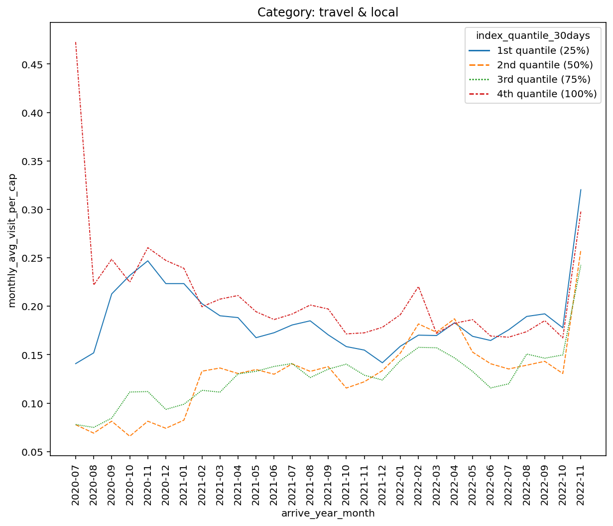

# Investigation into social compliance under COVID-19 lockdown policy in the US
This is a repo including some of the Apache Spark code scripts during my Research Assistantship at The Fuqua School of Business, Duke University from August 2022 till now. Our project aims to investigate people's social compliance patterns under the COVID-19 lockdown policies in the US.

## Data

<image src="./images/mfour_logo.gif" width="600" height="200">

The large-scale mobile tracking data we use came from our clients - [MFour Mobile Research](https://mfour.com/). The data contains the following part:
- Granular daily offline venue visits for panelist on records from 2003 to 2022
- Granular daily online website visits for panelists on records from 2020 to 2023
- Granular daily online APP visits for panelists on records from 2020 to 2023
- Panelists' demographic attributes
- The COVID-19 policy date that I compiled for every city in 2020

## EDA
- Plot the offline venue visit patterns for each category, and determine the most affected categories (hereafter referred to as **key categories**) to be used in later social compliance index construction
An example:

<image src="https://github.com/ShiningYang0207/Fuqua_RA_social_compliance/blob/main/images/EDA.png" width="750" height="300">

- Plot visits per capita for key categories in different regions to look into regional patterns
An example:

<image src="https://github.com/ShiningYang0207/Fuqua_RA_social_compliance/blob/main/images/region.png" width="750" height="750">

- The key categories to be used in the social compliance index construction are: Food, Nightlife Spot, Shop & Service, Art & Entertainment, Outdoors & Recreation

  
## Social Compliance Index Construction
We aimed to create a social compliance index for each individual to reflect their level of compliance under the lockdown policy, i.e. are they more likely to comply with the policy and stay at home, or will they still go out as much regardless of the policy? The steps could be summarized as follows:
- Find the earliest policy date that mandatorily requires people to stay at home in every city and use this as the start policy date
- social compliance index for each individual = $\frac
{\textbf{Total number of venue visits to key categories within the 30days since the earliest policy date in 2020}}{\textbf{Total number of venue visits to key categories within the same time frame but in 2019}}$
  
- Broke panelists down to 4 groups according to the social compliance percentile thresholds, and make plots for each categories
Some examples:

  
&nbsp; &nbsp; &nbsp; &nbsp;
  

  
&nbsp; &nbsp; &nbsp; &nbsp;
  

## Investigate the relationship between social compliance index and people's demographic attributes
- Set up baseline regression models with social compliance index being the dependent variable and people's demographic variables (age range, income level, education level, gender, race, marital status, employment status, the region he/she lives in)
- Baseline result shows that there is significant effect between the social compliance index and age range, income level, and education level. Younger people, people with lower income, and people with lower education levels tend to have lower social compliance - that is, they are more likely to go out more regardless of the lockdown policy.

## Map offline social compliance index onto online website and APP visits to explore interesting correlations
I tried to link the social compliance index we got from the offline visit data with the online website and APP visits, and plot for each online category for different social compliance index groups. Nothing particular has been carefully investigated yet, but we got some interesting patterns:

  
&nbsp; &nbsp; &nbsp; &nbsp;
  

Figure: some patterns for online website visits

  
&nbsp; &nbsp; &nbsp; &nbsp;
  

Figure: some patterns for online APP visits

